# Práctica 2 de Visión por Computador

## Datos de la práctica

- **Asignatura:** Visión por Computador
- **Práctica:** P2
- **Autores:** Félix Miguel Velásquez y Cristina Santana Martín
- **Cuaderno:** [`VC_P2_FMV_CSM.ipynb`](VC_P2_FMV_CSM.ipynb)

## Descripción

Esta práctica explora dos problemas de visión por computador:

1. Analizar la distribución espacial de los bordes de una imagen mediante Canny y Sobel.
2. Construir un demostrador interactivo capaz de segmentar una mano, localizar sus dedos y generar burbujas en las puntas detectadas.

## Requisitos

Para ejecutar el cuaderno se necesita Python 3 y las siguientes bibliotecas:

```bash
pip install opencv-python numpy matplotlib scipy
```

La tarea de análisis de vídeo requiere una webcam disponible y permisos para que Python pueda utilizarla.

## 1. Conteo de píxeles blancos con Canny

La primera tarea pide sustituir el conteo original por columnas por un conteo por filas. Para cada fila y columna se calcula el porcentaje de píxeles blancos de la imagen de bordes.

Se utiliza `cv2.Canny` sobre la imagen en escala de grises del mandril, con umbrales variables como 100 y/o 200. Después, se obtiene el máximo de cada serie y se seleccionan las posiciones donde el valor es mayor o igual que el 90 % (0.90*maxfil) del máximo:

```python
thres_rows, rows_loc = calculate_threshold(rows, 0.9)
thres_cols, cols_loc = calculate_threshold(cols, 0.9)
```

Las posiciones encontradas se marcan en la imagen de Canny: las filas aparecen en azul y las columnas en rojo. También se dibuja una línea horizontal en el 90 % del máximo sobre cada histograma.

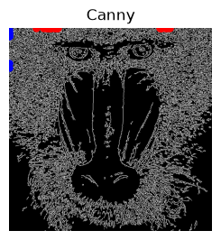

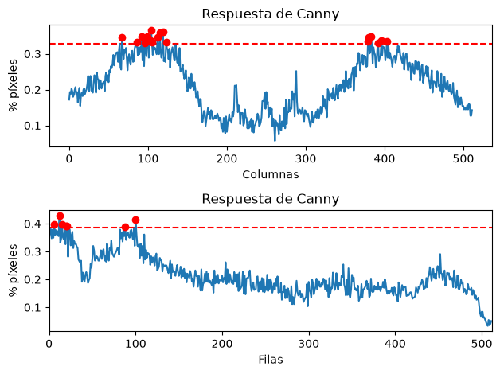

El resultado permite localizar las zonas de la imagen con mayor concentración de bordes. En el mandril, los máximos se relacionan principalmente con las zonas de mayor contraste del rostro, la nariz y el pelaje.

## 2. Comparación entre Canny y Sobel umbralizado

Para Sobel, se aplica primero un suavizado gaussiano de tamaño `3 x 3`. Luego, se aplica el algoritmo de Sobel para las columnas y filas por separado, se combinan y se convierten a 8 bits. Finalmente se aplica un umbral similar al método por Canny:

```python
gris_suave = cv2.GaussianBlur(gris, (3, 3), 0)
sobelx = cv2.Sobel(gris_suave, cv2.CV_64F, 1, 0)
sobely = cv2.Sobel(gris_suave, cv2.CV_64F, 0, 1)
sobel8 = cv2.convertScaleAbs(sobelx + sobely)
_, sobel_umbral_mat = cv2.threshold(sobel8, 100, 255, cv2.THRESH_BINARY)
```

Sobre la imagen binaria resultante, se repite el conteo de píxeles blancos por filas y columnas. Se calculan los máximos y se marcan las posiciones que superan el 90 % de cada máximo.

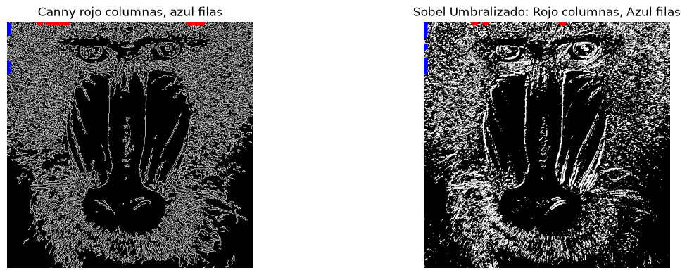

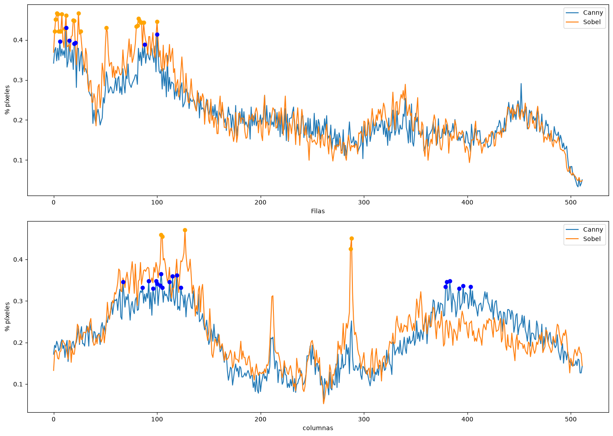

### Comparación de resultados

Al visualizar los resultados obtenidos mediante el umbralizado de sobel frente a la salida del Canny, podemos observar claramente el efecto de procesar la imagen por etapas.

Comparando Sobel respecto a Canny, se puede apreciar como Sobel umbralizado a 8 bits recoge mas detalles o imperfecciones en la superficie o contorno de la imagen. Atendiendo a la nariz, se puede observar como Canny resalta unos puntos gruesos redondos, mientras que Sobel lo resalta como puntos pequeños individuales esparcidos, como si fuesen motas de polvo. 

Adicionalmente, los pelos blancos individuales que salen de la nariz se ven mejor resaltados en Sobel, donde se pueden identificar mejor individualmente, mientras que en Canny esta superficie se mezcla con el ruido interior de la boca y pelaje adicional, insertando mucho ruido en la deteccion del borde.

Canny se construye precisamente sobre el gradiente de Sobel, mientras que en nuestro procedimiento manual con sobel debemos aplicar un umbralizado global. Canny añade etapas haciendo uso del filtro gausiano para reduicr el ruido, afinando los bordes con 1 pixel de grosor y un umbralizado.

El resultado es que Sobel umbralizado, los bordes tienden a ser más gruesos y mayor cantidad de ruido. Provocando que al realizar el conteo de filas y columnas pueden verse altos debido al grosor de las líneas y el rudio. Por lo contario, Canny, observamos bordes continuos, más finos y definidos.

En conclusión, el ejercicio ilustra cómo las etapas adicionales de Canny refinan la información.

## 3. Propuesta de demostrador: detección de manos

La segunda parte de la práctica se inspira de los videos interactivos de *My little piece of privacy*, *Messa di voce* y *Virtual air guitar*. La idea propuesta es implementar una tecnologia de detección algoritmica de forma manual y su interacción mediante una cámara. Para ello, se ha desarrollado el siguiente plan de acción:

- segmentar las regiones que tienen un color de piel compatible
- separar los objetos detectados mediante contornos
- identificar cuál de ellos tiene la geometría característica de una mano
- localizar las puntas de los dedos
- responder a cada dedo con una animación de burbujas

La segmentación combina dos espacios de color, HSV y YCrCb para crear la máscara de piel. Después se aplican operaciones morfológicas de apertura y cierre además de un desenfoque gaussiano, para eliminar ruido y rellenar pequeños huecos.

### 3.1. Primera implementación manual

En la primera versión, cada contorno se calcula encontrando su convex hull, sus defectos de convexidad y su solidez para identificar la morfología de las manos. Las manos abiertas suelen presentar valles entre los dedos, mientras que objetos compactos como una cara tienen pocos defectos profundos. Esto se aprecia en los histogramas de la máscara de piel.

El centro de la región se obtiene con `cv2.moments`. A partir de ese centro se seleccionan puntos del hull suficientemente alejados, que se consideran candidatos a puntas de los dedos.

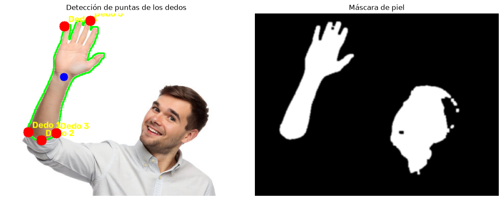

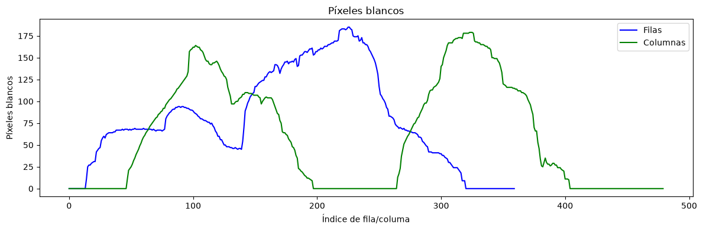

En esta prueba el método puede confundir la cabeza, el codo u otras regiones con una mano. Los histogramas ayudan a observar la diferencia entre una región vertical con varios picos y una región compacta con un único máximo.

### 3.2. Segunda prueba manual

La misma estrategia se prueba con una segunda imagen. El resultado muestra que la segmentación de piel puede ser razonable, pero la selección de contornos y de puntos extremos todavía depende mucho de la posición de la persona y del fondo.

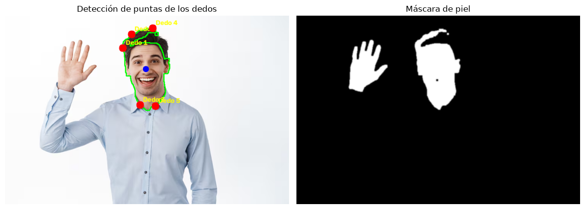

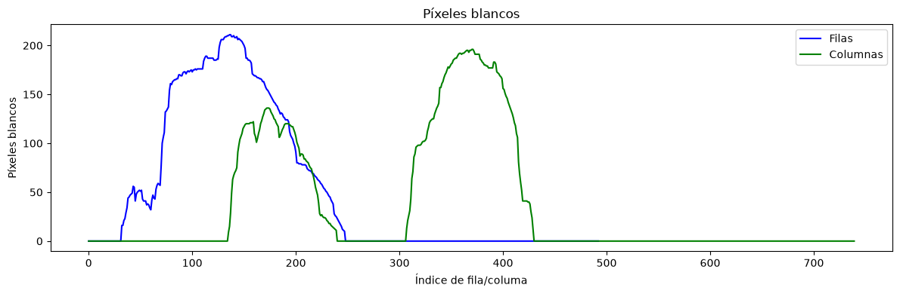

Estas pruebas motivan el refinamiento a continuación: en lugar de elegir únicamente los puntos más alejados del centro, se analiza la figura completa del contorno y se buscan picos con criterios en busqueda de una semejanza a los dedos y la palma de la mano.

## 4. Refinamiento mediante análisis de picos

La versión mejorada utiliza `scipy.signal.find_peaks` sobre una señal más circular construida a partir de la distancia de cada punto del contorno al centro de la palma. Una punta de dedo aparece como un máximo local de esa distancia, mientras que los valles entre dedos generan mínimos.

El procedimiento refinado sería:

1. Crear una máscara de piel con HSV y YCrCb
2. Limpiar la máscara con apertura, cierre, desenfoque y umbral binario
3. Obtener todos los contornos suficientemente grandes
4. Calcular el centro de cada figura mediante `cv2.moments`
5. Construir su firma radial respecto al centro
6. Suavizar la señal circular y localizar picos con `find_peaks`
7. Filtrar candidatos por prominencia, distancia al centro y separación angular (detección de dedos que no estén rectos)
8. Conservar como máximo cinco dedos y escoger la mano con más dedos

Junto a este nuevo proceso, podemos extraer ciertos parámetros del proceso que nos permitirán refinar mejor la detección a medida que se prueba el algoritmo.

```python
MIN_AREA_FRAC = 0.005
MIN_FINGERS = 2
MIN_TIP_DIST = 1.4
MIN_PROMINENCE = 0.20
MIN_PROTRUSION = 0.45
CORE_OPENING = 0.55
MAX_TIP_SPREAD = 170
```

### 4.1. Resultados de la primera versión refinada

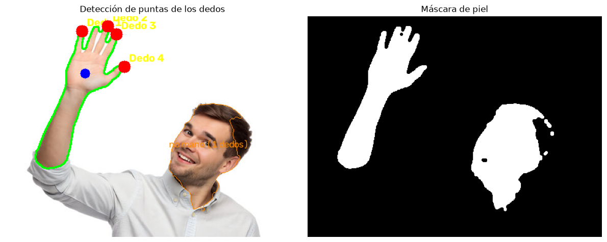

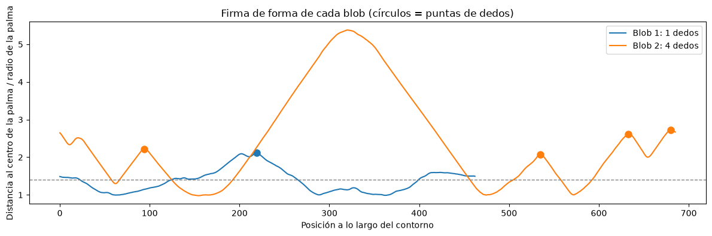

En la firma radial, los círculos señalan los máximos considerados puntas. Además, se presenta una figura descartada por el algoritmo dada la insuficiencia de picos y prominencia de contornos solidos que conlleva a una figura distinta de una palma o dedo.

### 4.2. Resultados de la segunda versión refinada

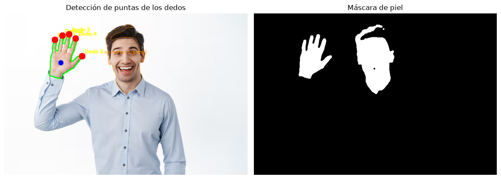

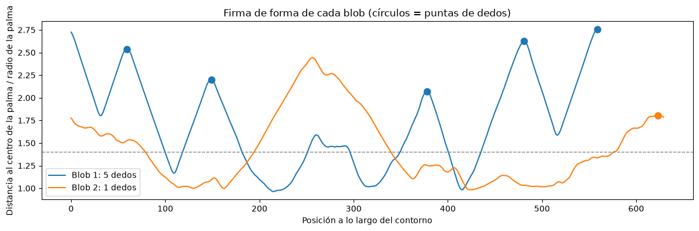

La segunda prueba muestra una detección más estable: se encuentran varios dedos, se marca el centro de la palma en azul y se dibuja el contorno de la mano en verde. Los puntos rojos representan las puntas y las etiquetas amarillas identifican cada dedo.

## 5. Interacción con burbujas

La clase `Burbuja` representa el efecto visual fijado a cada punta detectada. Cada burbuja tiene posición, velocidad, radio, color y vida útil. En cada iteración:

- Creamos una burbuja con una probabilidad del 65 % por cada dedo
- Actualizar su posición y su velocidad
- Reducir su vida
- Eliminar la burbuja cuando expira o sale de la imagen
- Dibujarla sobre el resultado de la detección

La cámara se refleja horizontalmente para que la interacción resulte más natural.

```python
run_live_detection_with_bubbles()
```

La salida combina la imagen anotada con la máscara de piel y convierte las puntas de los dedos en puntos de interacción para el demostrador.

## 6. Limitaciones y posibles mejoras

- La segmentación depende de la iluminación, el balance de blancos y el tono de piel capturado por la calidad de la cámara
- Un fondo con colores parecidos a la piel puede producir falsos positivos
- La cara y el brazo pueden conectarse con la mano o generar defectos y figuras parecidos a los de una mano
- Los umbrales son fijos: sería requeriría una previa calibración con el dispositivo para refinar los parametros para su mejor funcionamiento

## 7. Fuentes y asistencia de IA

- [cv2.moments: detección de centros en contornos y figuras](https://learnopencv.com/find-center-of-blob-centroid-using-opencv-cpp-python/)
- [cv2.convexHull: mejora de detección de manos](https://docs.opencv.org/3.4.20/d7/d1d/tutorial_hull.html)
- [cv2.morphologyEx: máscara de piel](https://learnopencv.com/invisibility-cloak-using-color-detection-and-segmentation-with-opencv/)
- [Claude: mejora de algoritmo mediante extracción de picos de manos](https://claude.ai/share/861b40c9-9988-4fab-b119-7dc6619a91d9)
- [Gemini: Implementación del filtro de burbujas](https://claude.ai/share/861b40c9-9988-4fab-b119-7dc6619a91d9)